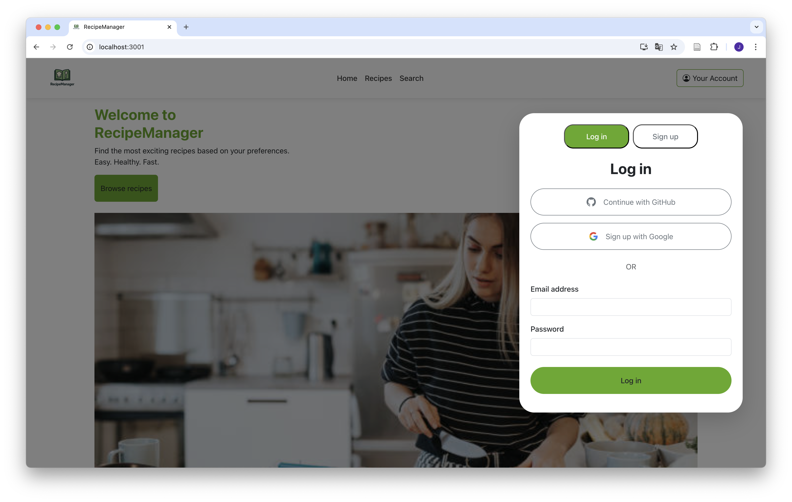
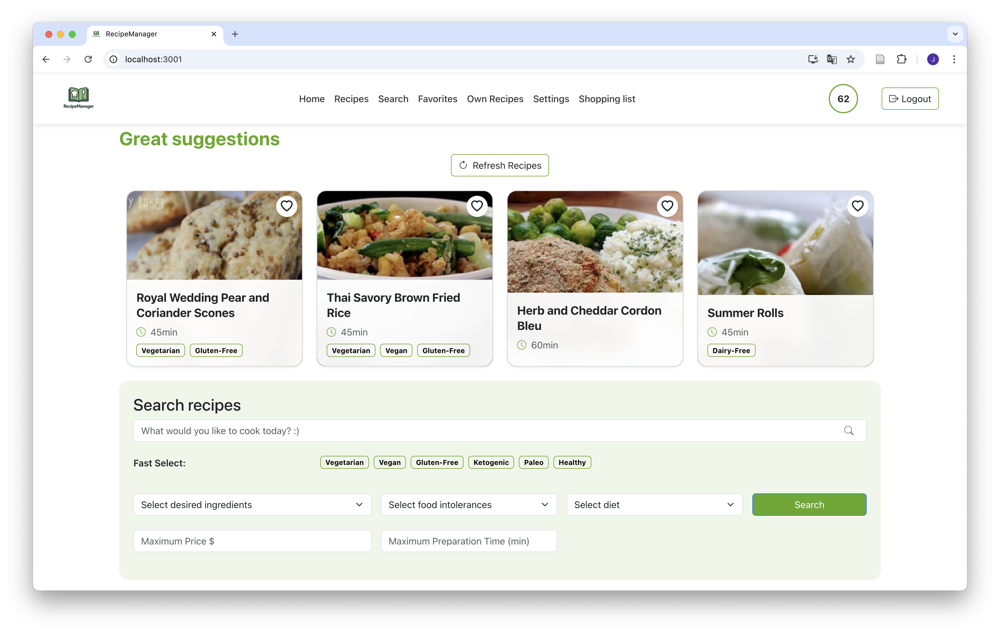
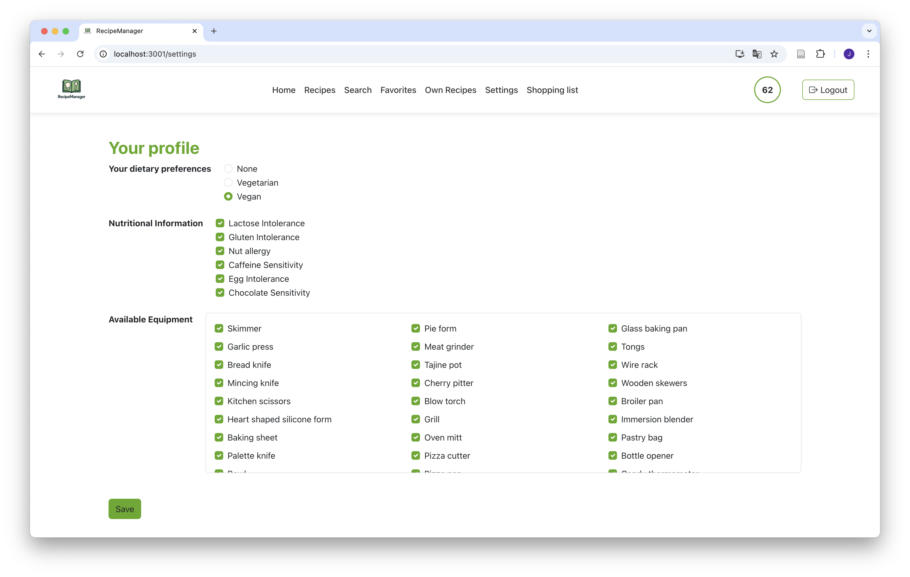
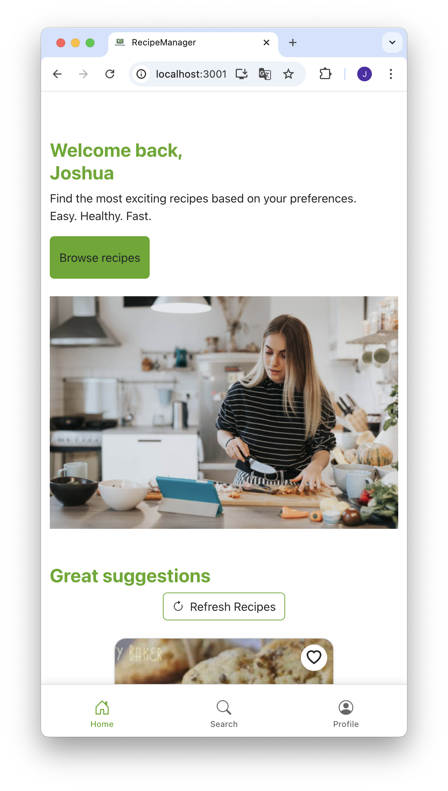
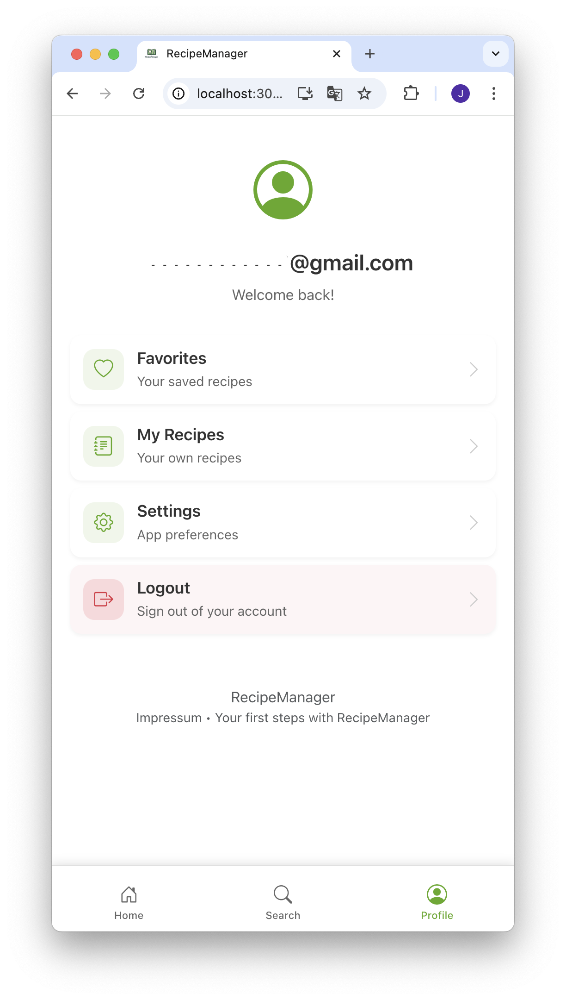

# RecipeManager

**RecipeManager** is a modern web-based application for managing, discovering, and filtering recipes based on personal preferences, dietary needs, preparation time, and cost. The app is designed for people with a health-conscious lifestyle, limited time, or specific dietary requirements.

---

## Tech Stack

- **Frontend:** React (JavaScript)
- **Authentication:** Firebase Authentication (Google & GitHub login)
- **Database:** Firebase Firestore
- **File Storage:** Firebase Storage (for custom recipe information) & Cloudinary (for custom recipe images)
- **Deployment:** Docker (containerized)
- **Design System:** Bootstrap

---

## Features

### Must-Have Features

- Search and filter recipes by:
  - Ingredients
  - Preparation time
  - Estimated cost
  - Dietary tags (e.g., vegan, gluten-free)
- Personalized recipe suggestions (for logged-in users)
- Create, edit, and delete personal recipes
- Save favorite recipes and organize them into custom collections
- Cost estimation for each recipe
- Share recipes via link or recipe card
- User registration and login via email, Google, or GitHub
- Dietary intolerance preferences used to filter suggestions

### Nice-to-Have Features

- Weekly meal planner with shopping list generator
- Import recipes from external platforms (e.g., Chefkoch)
- Rate and comment on recipes
- Gamification elements (e.g., health score)
- Filter recipes based on available kitchen equipment
- "What's in my fridge?" ingredient-based search

---

## User Roles

- **Guest User:**
  - Browse public recipes
  - Use search and filtering
  - Share recipes

- **Registered User:**
  - Create and manage personal recipes
  - Save favorite recipes and organize them in collections
  - Set dietary preferences and intolerances
  - Receive personalized suggestions

---

## Project Structure

```bash
.
├── public/
├── src/
│   ├── assets/
│   ├── components/
│   │      ├── cards/
│   │      ├── lists/
│   │      ├── pages/
│   │      ├── subcomponents/
│   ├── data/
│   ├── features/
│   │   ├── databaseStorage/
│   │   ├── AuthContext.js
│   │   ├── firebase.js
│   ├── styles/
│   └── App.js
├── .env
├── .gitIgnore
└── README.md
```


# Setup & Installation

Follow these steps to set up and run the RecipeManager project locally:

---

## with Docker
### 1. Clone the Repository

```bash
git clone https://github.com/jshProgrammer/recipemanager.git
cd RecipeManager
````

### 2. Configure Firebase and Cloudinary
Create a .env file in the root directory and add your Firebase configuration:

```env
REACT_APP_FIREBASE_API_KEY=your_api_key
REACT_APP_FIREBASE_AUTH_DOMAIN=your_auth_domain
REACT_APP_FIREBASE_PROJECT_ID=your_project_id
REACT_APP_FIREBASE_STORAGE_BUCKET=your_storage_bucket
REACT_APP_FIREBASE_MESSAGING_SENDER_ID=your_sender_id
REACT_APP_FIREBASE_APP_ID=your_app_id
REACT_APP_CLOUDINARY_CLOUD_NAME=your_cloud_name
REACT_APP_CLOUDINARY_UPLOAD_PRESET=your_upload_preset
```

### 3. Build image

```bash
docker build -t recipemanager .
```

### 4. Start the container
```bash
docker run -p 3000:80 recipemanager
```
Visit http://localhost:3000 in your browser to view the app.

## without Docker

### 1. Clone the Repository

```bash
git clone https://github.com/jshProgrammer/recipemanager.git
cd RecipeManager
````

### 2. Install Dependencies
Make sure you have Node.js and npm installed. Then run:

```bash
npm install
```

### 3. Configure Firebase and Cloudinary
Create a .env file in the root directory and add your Firebase configuration:

```env
REACT_APP_FIREBASE_API_KEY=your_api_key
REACT_APP_FIREBASE_AUTH_DOMAIN=your_auth_domain
REACT_APP_FIREBASE_PROJECT_ID=your_project_id
REACT_APP_FIREBASE_STORAGE_BUCKET=your_storage_bucket
REACT_APP_FIREBASE_MESSAGING_SENDER_ID=your_sender_id
REACT_APP_FIREBASE_APP_ID=your_app_id
REACT_APP_CLOUDINARY_CLOUD_NAME=your_cloud_name
REACT_APP_CLOUDINARY_UPLOAD_PRESET=your_upload_preset
```

### 4. Start the Server
```bash
npm start
```
Visit http://localhost:3000 in your browser to view the app.

# Screenshots





